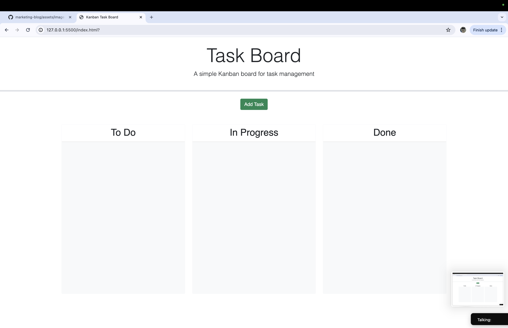

# TASK BOARD

A taskboard is an escencial tool for a develepor to be able to organize and help plan out to meet deadlines.

I've given myself the liberty of creating a virtual taskboard with interactive colours to display how soon your tasks are to be due!

## Usage

This application is of free use for anybody who needs a bit of help to get oraganized. Feel free to utilize this taskboard to your heart's content.

## Suggestions

Huh? What's that, have a suggestion on how to improve this application? Well, feel free to reach out, I'll try my best to make your ideas a reality! :D

## Screenshots
     
Here's how the application shall function:

# THANKS FOR CHOOSING THIS PRODUCT